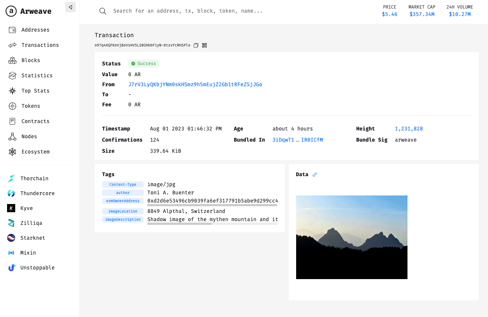

# arweave-tools

This is a small collection of arweave scripts for illustation and usage.

- [create-wallet.ts](src/create-wallet.ts) : a new arweave wallet is created and save to `./outdata`
- [wallet-info.ts](src/wallet-info.ts) : read address, balance and loaded balance (on bundlr) from a saved wallet
- [fund-bundlr.ts](src/fund-bundlr.ts) : provide funds to a bundlr provider
- [upload-data-bundlr.ts](src/upload-data-bundlr.ts) : upload a file to arweave blockchain with bundlr


## Setups

- `nvm use 20` (node version 20)
- 'npm install' ...

### .env

Create a .env file with the following entries:

```
ARWEAVE_HOST=arweave.net
ARWEAVE_PORT=443
ARWEAVE_PROTOCOL=https

BUNDLR_NETWORK=http://node2.bundlr.network

WALLET_FILE=/.../arweave-keyfile-....json

UPLOAD_IMAGE_FILE_MYTHEN=/.../data/mythen.jpg
```
## Docs & Refs

- arweave.org : https://www.arweave.org/
- Block explorer: https://viewblock.io/arweave 
- Using bundlr etc.: https://www.youtube.com/watch?v=TMzKoxpf_GU

### Wallets management in browser/mobile:

- **ArConnect** browser extension
- **Arweave.app** mobile app


## Examples

### Upload Mythen

- Uploaded image file 'Mythen': https://www.arweave.net/o97q4XQFKoVj8oVsHV5LS0OXkbFiyN-6tzvFcRHSPlo 
- ... on blockchain: https://viewblock.io/arweave/tx/o97q4XQFKoVj8oVsHV5LS0OXkbFiyN-6tzvFcRHSPlo



## Alternative Libs 


- https://arseed.web3infra.dev/2bpKpp0dtfFZE82-P0lOmeI5x4m
